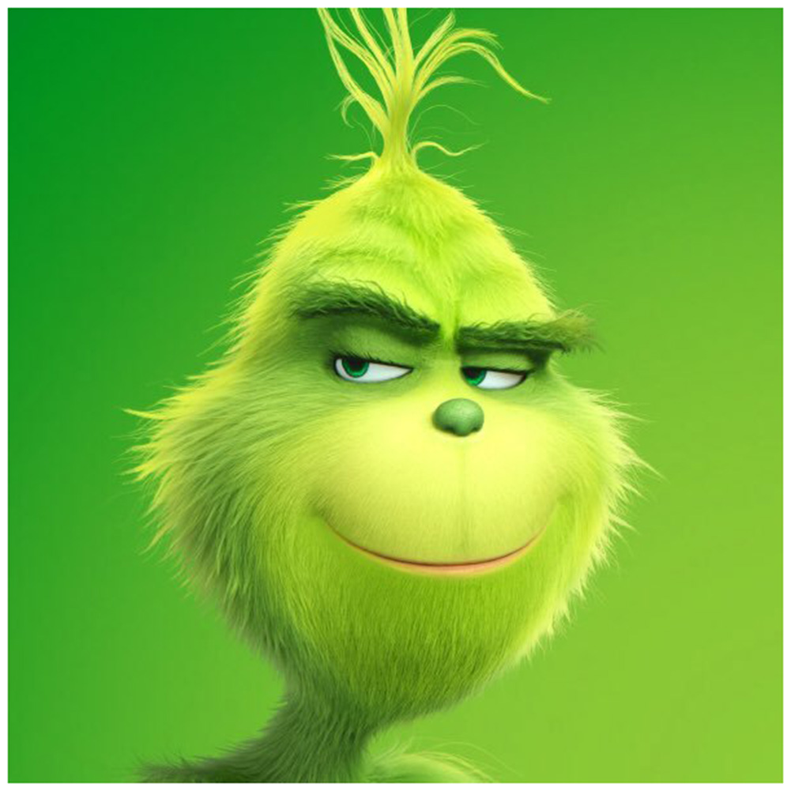

<a id = "anchor"></a>
# Заголовое
## заголовок
###### заголо
* tecst
    * test
---
___
***
__new__
_new_
___new___
```Helloooooo```
    ___Поставь 4 пробела __
>Цитата
>> Hellooo


[](https://yandex.ru/video/preview/14375790206913627495?text=руки%20мыть%20руки%20мыть%20нужно%20каждый%20день&path=yandex_search&parent-reqid=1734984275878214-10972851088401222900-balancer-l7leveler-kubr-yp-klg-163-BAL&from_type=vast)


# Таблицы

one | two| three
:-|:-:|-:|
red|:sleepy:|:sleeping:
blue|:star:|:fish:
orange|:blossom:|:full_moon:
black|:skull:|:notes:

Termin
: Opredelenie
: Kukushka


#### Сноски(почему то не работает)

[^1]: Текст сноска 1
[^2]: текст Сноска 2

__Якорь__
[Вверх](#anchor)